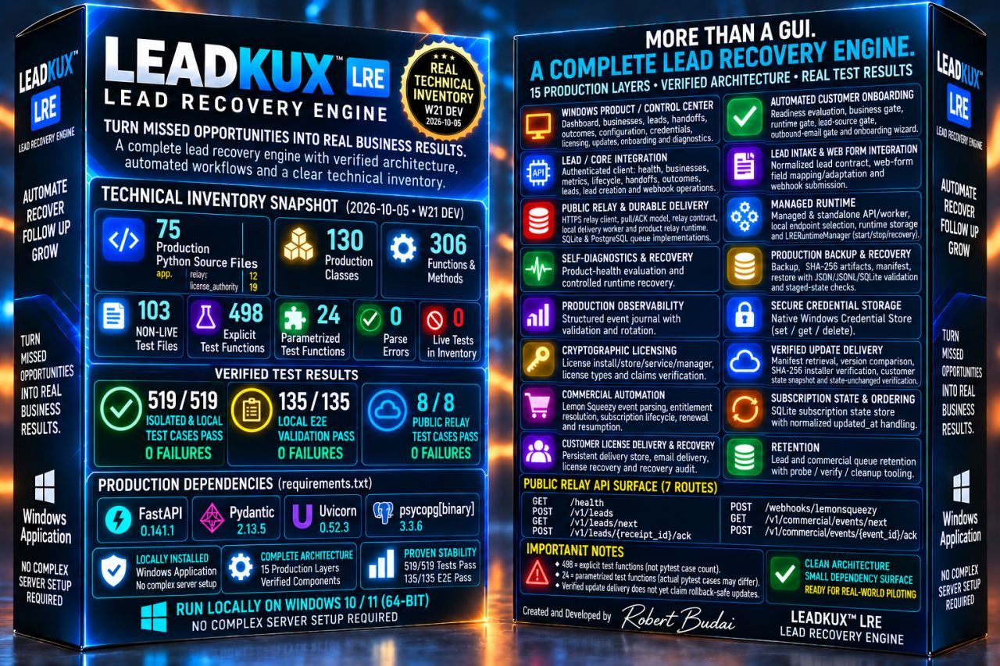

# LeadKux™ — Lead Recovery Engine

## Turn missed opportunities into real business results.

LeadKux is a Windows-based lead recovery and customer lifecycle system designed to help businesses capture, process and recover opportunities before they go cold.

### 🌐 Live Website

**[Visit LeadKux →](https://leadrecoverycore.com/)**

---

### Product Highlights

- Windows Control Center
- Automated Customer Onboarding
- Lead Intake & Web Form Integration
- Authenticated HTTPS Relay
- Durable SQLite + PostgreSQL delivery queues
- Managed API & Worker Runtime
- Self-Diagnostics & Recovery
- Production Backup & Recovery
- Production Observability
- Secure Windows Credential Storage
- Cryptographic Licensing
- SHA-256 Verified Update Delivery
- Commercial Subscription Automation
- Customer License Delivery & Recovery
- Controlled Queue Retention

---

### Technical Snapshot

**75** active production Python source files  
**130** production classes  
**306** functions and methods  
**103** active non-live test files  
**498** explicit `test_*` functions

Executed validation runs are reported separately from static inventory counts.

---

### Status

LeadKux is currently entering its **Founding Customer / Early Commercial Release** stage.

Technical validation does not constitute proof of customer ROI or conversion uplift. Real-world commercial outcomes require live customer validation.

---

Developed by **Robert Budai**

© 2026 LeadKux
